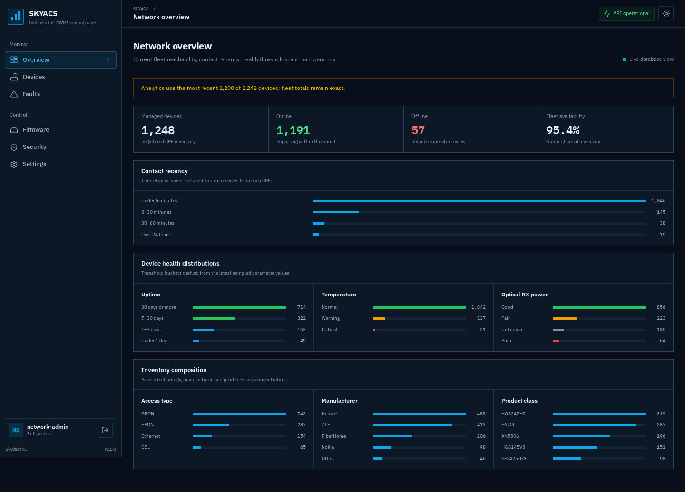

<div align="center">

<h1>SKYACS</h1>

<p><strong>Independent TR-069/CWMP control plane for managed CPE fleets</strong></p>

[](https://github.com/skydashnet/SKYACS)
[](https://go.dev/)
[](https://nodejs.org/)
[](https://www.postgresql.org/)
[](LICENSE)
[](https://saweria.co/skydashnet)

</div>

SKYACS is a standalone TR-069/CWMP control plane for CPE inventory, monitoring, provisioning, and configuration. Its CWMP server, management API, scheduler, database layer, and web console run as one independent platform without requiring GenieACS.

<p align="center">
  
  <br />
  <sub>Network overview with representative lab telemetry.</sub>
</p>

> **Project status:** Beta. Validate every device workflow in a lab and maintain a recovery path before running bulk configuration changes or firmware upgrades.

## Highlights

- TR-098 (`InternetGatewayDevice`) and TR-181 (`Device`) data-model discovery
- Device inventory, fleet statistics, parameter trees, faults, provisioning rules, and task history
- Get/Set parameter operations, reboot, factory reset, connection requests, and firmware delivery
- Full-access and read-only roles with revocable session-scoped tokens
- Password policy, login throttling, audit logging, and device admission blocklist
- CWMP Basic Authentication over TLS, CIDR allowlists, and trusted-proxy validation
- DNS-rebinding and redirect-resistant SSRF protection for connection request URLs
- Signed firmware URLs with random tokens and expiry; firmware tasks expire after 24 hours
- AES-GCM encryption for sensitive parameters and masking for read-only operators
- Responsive operational console built with IBM Plex Sans and IBM Plex Mono
- System-aware dark and light themes with no UI dependency on another ACS platform

## Architecture

| Service | Default port | Purpose |
| --- | ---: | --- |
| Web console | `5173/tcp` | SolidJS production bundle |
| Management API | `7548/tcp` | Authenticated API and signed firmware delivery |
| CWMP | `7547/tcp` | TR-069 sessions from managed CPEs |
| PostgreSQL | `5432/tcp` | Persistent operational state |

The backend uses Go 1.25, GORM, and PostgreSQL. The frontend uses SolidJS, TypeScript, Tailwind CSS, and Vite.

## Quick start

### Automated installation on Debian or Ubuntu

```bash
git clone https://github.com/skydashnet/SKYACS.git
cd SKYACS
chmod +x auto-setup.sh
sudo ./auto-setup.sh
```

The installer provisions PostgreSQL, generates application secrets, builds the production artifacts, and installs the `skyacs` and `skyacs-web` systemd units. The bootstrap password is printed once and can also be retrieved from the initial service logs:

```bash
sudo journalctl -u skyacs -n 50 --no-pager
```

### Manual development setup

```bash
cp backend/.env.example backend/.env
# Edit backend/.env. JWT_SECRET and PARAMETER_ENCRYPTION_KEY are required.
./setup.sh

cd backend
go run ./cmd/server
```

Start the frontend in another terminal:

```bash
cd frontend
npm ci
npm run dev
```

The initial username is `admin`. Its password is read from `INITIAL_ADMIN_PASSWORD`; when that variable is empty, the backend generates and prints a random password once while creating the first operator. SKYACS does not ship with an `admin/admin` credential.

## Security configuration

Important variables in `backend/.env`:

```env
PORT=7547
API_PORT=7548
CWMP_BIND_ADDR=127.0.0.1
API_BIND_ADDR=127.0.0.1
JWT_SECRET=<minimum-32-random-characters>
PARAMETER_ENCRYPTION_KEY=<minimum-32-random-characters>

DB_HOST=localhost
DB_PORT=5432
DB_NAME=skyacs
DB_USER=skyacs
DB_PASSWORD=<database-password>
DB_MAX_OPEN_CONNS=50
DB_MAX_IDLE_CONNS=10

CORS_ALLOWED_ORIGINS=https://acs.example.com
TRUSTED_PROXY_CIDRS=127.0.0.1/32
CWMP_USERNAME=
CWMP_PASSWORD=
CWMP_ALLOWED_CIDRS=10.0.0.0/8,192.0.2.0/24
CWMP_TRUSTED_PROXY_CIDRS=127.0.0.1/32
CONNECTION_REQUEST_ALLOWED_CIDRS=10.0.0.0/8,192.0.2.0/24
FIRMWARE_UPLOAD_DIR=/var/lib/skyacs/firmware
ALLOW_INSECURE_FIRMWARE_URL=false
```

Configure these values from **Settings** after signing in:

- `firmware_base_url`: the API base URL reachable by managed CPEs, for example `https://acs.example.com/api` when Nginx exposes the API under `/api`.
- Connection request credentials. Automatic mode requires a master secret of at least 16 characters and derives a unique HMAC-SHA256 password for every serial number.

When `CWMP_USERNAME` is configured, `CWMP_PASSWORD` is also required. Basic Authentication is rejected over plain HTTP; TLS termination must originate from an address in `CWMP_TRUSTED_PROXY_CIDRS`. `TRUSTED_PROXY_CIDRS` controls API client-IP headers and must contain proxy addresses only. `CONNECTION_REQUEST_ALLOWED_CIDRS` restricts the destinations that SKYACS may contact and should contain CPE networks. Protect the CWMP endpoint with network firewall rules even when the application allowlist is enabled.

`PARAMETER_ENCRYPTION_KEY` protects stored passwords and sensitive parameters. Back up this key together with the database. Do not replace it directly; key rotation requires a data migration and re-encryption process.

## Reverse proxy

Use [setup_nginx.md](setup_nginx.md) for TLS termination, static frontend delivery, the API prefix, and firmware upload limits. For deployments using Cloudflare, read [setup_cloudflare.md](setup_cloudflare.md). Firmware endpoints must remain reachable by managed CPEs without an interactive Access login.

## Production baseline

Before deploying SKYACS into an operational network:

1. Terminate TLS for the web console, API, and CWMP endpoint. Never expose ports `5173` or `7548` directly.
2. Configure explicit CORS and trusted-proxy values, then restrict CWMP access with firewall and CIDR rules.
3. Run services under a non-root account, back up PostgreSQL and firmware storage, and test restoration.
4. Validate Get/Set, reboot, factory reset, and firmware delivery for every vendor, model, and firmware combination. Factory reset requires operator re-authentication.
5. Monitor `/api/health`, systemd state, database capacity, firmware storage, and failed tasks or faults.

Example single-node backup:

```bash
sudo -u postgres pg_dump -Fc skyacs > skyacs-$(date +%F).dump
sudo tar -C /var/lib/skyacs -czf skyacs-firmware-$(date +%F).tar.gz firmware
```

SKYACS currently operates as a **single-node control plane**. Local firmware storage and the in-process scheduler are not designed for active-active or high-availability deployments. Run one backend instance per database. The project remains in beta until a public vendor interoperability matrix and fleet load-test results are available.

## Validation

```bash
cd backend
go test -race ./...
go vet ./...
go run honnef.co/go/tools/cmd/staticcheck@2025.1.1 ./...
go run golang.org/x/vuln/cmd/govulncheck@v1.6.0 ./...
go run github.com/securego/gosec/v2/cmd/gosec@v2.22.9 -quiet ./...

cd ../frontend
npm ci
npm audit
npm run build

cd ..
bash -n setup.sh auto-setup.sh
```

The CI workflow runs the same checks on every push and pull request.

## Device support

SKYACS supports CPEs that implement CWMP/TR-069 with a TR-098 or TR-181 root. Vendor extensions vary across firmware releases, so always verify writable parameters in a lab. The console recognizes common Huawei, ZTE, and FiberHome parameter patterns, but compatibility is not guaranteed for every firmware version.

The currently handled RPCs include `Inform`, `TransferComplete`, SOAP Fault, and responses for `GetParameterValues`, `GetParameterNames`, `SetParameterValues`, `Reboot`, `FactoryReset`, and `Download`. Methods outside this matrix receive CWMP fault `8000` and must be validated before onboarding devices that depend on them.

## Support SKYACS

If SKYACS helps your network operations, support its continued development and maintenance through Saweria.

<p align="center">
  <a href="https://saweria.co/skydashnet"></a>
</p>

## Reporting security issues

Do not disclose unresolved vulnerabilities through a public issue. Follow the process documented in [SECURITY.md](SECURITY.md).

## License

GNU Affero General Public License v3.0. See [LICENSE](LICENSE).
